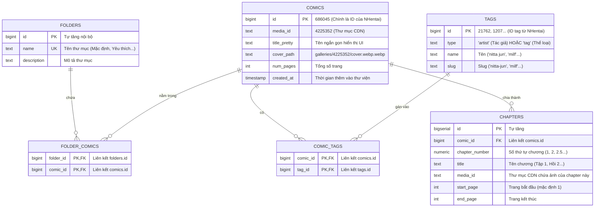

# 📚 Kiến Trúc Cơ Sở Dữ Liệu & Cơ Chế Khôi Phục Dữ Liệu (HManga-Library)

Tài liệu này tổng hợp toàn bộ các quyết định thiết kế kiến trúc mới cho hệ thống cơ sở dữ liệu (Database Schema), luồng phân loại Tác giả/Thể loại, cơ chế phân chia Chapter và phương án dự phòng khôi phục dữ liệu (Disaster Recovery) tối ưu cho **Supabase (PostgreSQL)** và **Local SQLite**.

---

## 1. Bối cảnh & Lý do thay đổi

Qua phân tích trực tiếp JSON payload trả về từ **NHentai API v2** (ví dụ gallery `686041`, `686045`), hệ thống cũ bộc lộ nhiều điểm hạn chế:
1. **Khái niệm `id` và `media_id`**: `id` là mã truyện trên web, nhưng `media_id` mới là thư mục lưu ảnh thực tế trên CDN. Thiếu `media_id` dẫn đến lỗi tải ảnh khi 2 số này khác nhau.
2. **Đuôi mở rộng bất quy tắc**: NHentai có các đường dẫn ảnh dị dạng như `cover.webp.webp`, `2t.webp.webp`. Việc sinh link theo công thức cố định `1.webp`, `2.webp` dễ dẫn đến lỗi 404.
3. **Bản chất của Tác giả**: NHentai không có bảng hoặc endpoint riêng cho tác giả. Tác giả thực chất là một Tag có `type = 'artist'` (hoặc `type = 'group'`).
4. **Mục tiêu tối giản của Thư viện**: Thư viện cá nhân chỉ cần quản lý **Thư mục (Folders)**, **Truyện (Comics)**, **Tác giả (Authors)** và **Chapters**, loại bỏ các trường và bảng trung gian không cần thiết.

---

## 2. Sơ đồ Cơ sở dữ liệu mới (Entity Relationship Diagram)

Hệ thống được chuẩn hóa về mô hình **5 bảng cốt lõi + 1 bảng Chapter**, dùng trực tiếp ID của NHentai làm khóa chính (`PRIMARY KEY`) để loại bỏ hoàn toàn bước tra cứu (Zero-Lookup Insertion):



---

## 3. Mã SQL Khởi tạo (Chạy trên Supabase / PostgreSQL)

```sql
-- Kích hoạt extension hỗ trợ tìm kiếm mờ (Fuzzy Search)
CREATE EXTENSION IF NOT EXISTS pg_trgm;

-- 1. Bảng Thư mục (Spotify-Style Folders)
CREATE TABLE IF NOT EXISTS folders (
    id BIGSERIAL PRIMARY KEY,
    name TEXT UNIQUE NOT NULL,
    description TEXT DEFAULT '',
    created_at TIMESTAMPTZ DEFAULT NOW()
);

-- 2. Bảng Truyện (5 trường cốt lõi)
CREATE TABLE IF NOT EXISTS comics (
    id BIGINT PRIMARY KEY,                    -- ID gốc NHentai
    media_id TEXT NOT NULL,                   -- Thư mục CDN gốc
    title_pretty TEXT NOT NULL,               -- Tên truyện ngắn gọn
    cover_path TEXT NOT NULL,                 -- Đường dẫn ảnh bìa chuẩn từ JSON
    num_pages INT NOT NULL DEFAULT 1,         -- Số trang
    created_at TIMESTAMPTZ DEFAULT NOW()
);

-- 3. Bảng Tag chung (Chỉ lưu type 'artist' và 'tag')
CREATE TABLE IF NOT EXISTS tags (
    id BIGINT PRIMARY KEY,                    -- ID tag NHentai
    type TEXT NOT NULL,                       -- 'artist' hoặc 'tag'
    name TEXT NOT NULL,                       -- Tên hiển thị
    slug TEXT NOT NULL                        -- Slug tìm kiếm
);

-- 4. Bảng liên kết Truyện - Thư mục
CREATE TABLE IF NOT EXISTS folder_comics (
    folder_id BIGINT REFERENCES folders(id) ON DELETE CASCADE,
    comic_id BIGINT REFERENCES comics(id) ON DELETE CASCADE,
    added_at TIMESTAMPTZ DEFAULT NOW(),
    PRIMARY KEY (folder_id, comic_id)
);

-- 5. Bảng liên kết Truyện - Tag
CREATE TABLE IF NOT EXISTS comic_tags (
    comic_id BIGINT REFERENCES comics(id) ON DELETE CASCADE,
    tag_id BIGINT REFERENCES tags(id) ON DELETE CASCADE,
    PRIMARY KEY (comic_id, tag_id)
);

-- 6. Bảng Quản lý Chapter (Mô hình thống nhất)
CREATE TABLE IF NOT EXISTS chapters (
    id BIGSERIAL PRIMARY KEY,
    comic_id BIGINT REFERENCES comics(id) ON DELETE CASCADE,
    chapter_number NUMERIC NOT NULL,
    title TEXT,
    media_id TEXT NOT NULL,                   -- CDN media của chapter
    start_page INT NOT NULL DEFAULT 1,
    end_page INT NOT NULL
);

-- ==================== INDEXES TĂNG TỐC ĐỘ ====================
CREATE INDEX IF NOT EXISTS idx_comics_title ON comics USING gin (title_pretty gin_trgm_ops);
CREATE INDEX IF NOT EXISTS idx_tags_type ON tags(type);
CREATE INDEX IF NOT EXISTS idx_comic_tags_tag ON comic_tags(tag_id);
CREATE INDEX IF NOT EXISTS idx_folder_comics_folder ON folder_comics(folder_id);
CREATE INDEX IF NOT EXISTS idx_chapters_comic_id ON chapters(comic_id);
```

---

## 4. Cơ chế Phân chia Chapter Thống nhất (Unified Chapter Model)

Bằng việc đưa trường `media_id` vào trực tiếp bảng `chapters`, hệ thống xử lý đồng thời cả 2 bài toán một cách tự nhiên:

### Trường hợp 1: Gộp nhiều Gallery riêng biệt thành 1 bộ truyện
- **Bối cảnh**: Bộ truyện dài tập gồm Tập 1 (Gallery `111111`, media `4100001`, dài 20 trang) và Tập 2 (Gallery `222222`, media `4200002`, dài 30 trang).
- **Lưu trữ**:
  - `Chapter 1`: `media_id = "4100001"`, `start_page = 1`, `end_page = 20`.
  - `Chapter 2`: `media_id = "4200002"`, `start_page = 1`, `end_page = 30`.
- **Kết quả**: Trình đọc tự động đổi thư mục CDN khi người dùng chuyển chapter.

### Trường hợp 2: Chia 1 bộ truyện dài thành nhiều Chapter
- **Bối cảnh**: Bộ truyện 100 trang (Gallery `333333`, media `4300003`) muốn chia làm 2 phần.
- **Lưu trữ**:
  - `Chapter 1`: `media_id = "4300003"`, `start_page = 1`, `end_page = 50`.
  - `Chapter 2`: `media_id = "4300003"`, `start_page = 51`, `end_page = 100`.
- **Kết quả**: Cả 2 chapter dùng chung `media_id`, chỉ khác dải trang bắt đầu và kết thúc.

---

## 5. Luồng Tác giả & Thể loại giữa "Thư viện" và "Khám phá"

Mô hình **Cá nhân hóa trang Khám phá (Personalized Discovery)** hoạt động như sau:

1. **Lưu truyện vào Thư viện**:
   - Backend lọc mảng `tags` từ NHentai: Chỉ lấy những tag có `type = 'artist'` (Tác giả) và `type = 'tag'` (Thể loại) để lưu vào bảng `tags`.
2. **Trong Thư viện**:
   - Xem truyện theo Tác giả: Bấm vào tên tác giả $\rightarrow$ truy vấn các truyện đã lưu của tác giả đó.
3. **Trong trang Khám phá (Discover NHentai)**:
   - Bộ lọc Tác giả & Thể loại chỉ hiển thị các tag **đang có trong thư viện của bạn**:
     ```sql
     -- Lấy Tác giả / Thể loại của các truyện ĐÃ LƯU
     SELECT DISTINCT t.id, t.name, t.slug, t.type
     FROM tags t
     JOIN comic_tags ct ON t.id = ct.tag_id;
     ```
   - Khi bấm chọn trên bộ lọc: Frontend gọi API NHentai tìm kiếm toàn bộ tác phẩm trên mạng:
     - Chọn Tác giả: `GET /api/v2/search?query=artist:"nitta jun"`
     - Chọn Thể loại: `GET /api/v2/search?query=tag:"milf"`
     - Kết hợp cả hai: `GET /api/v2/search?query=artist:"nitta jun" tag:"milf"`

---

## 6. Cơ chế Sao lưu & Dự phòng Thảm họa (Disaster Recovery Plan)

### Bản chất của Supabase Cloud:
- Khi sử dụng **Supabase**, toàn bộ dữ liệu nằm trên máy chủ Cloud (chạy 24/7).
- Bạn có thể xóa project trên máy tính, clone lại code từ GitHub $\rightarrow$ điền URL và KEY vào `.env` là hệ thống chạy bình thường ngay lập tức, **không cần chạy lệnh khôi phục**.

### Phương án dự phòng (Khi Supabase bị xóa sau 1-2 tháng không dùng):
File `backend/data/backup.json` đóng vai trò là bản snapshot dự phòng an toàn tuyệt đối.

#### Định dạng `backup.json` tối giản (Không metadata thừa):
```json
{
  "folders": [
    { "id": 1, "name": "Mặc định" },
    { "id": 2, "name": "Yêu thích" }
  ],
  "comics": [
    {
      "id": 686045,
      "media_id": "4225352",
      "title": "Mama no Jitsuryoku | Mom's Skills",
      "cover": "galleries/4225352/cover.webp.webp",
      "pages": 16,
      "folders": [1],
      "tags": [
        { "id": 21762, "type": "artist", "name": "nitta jun", "slug": "nitta-jun" },
        { "id": 1207, "type": "tag", "name": "milf", "slug": "milf" }
      ],
      "chapters": [
        {
          "chap": 1,
          "title": "Tập 1",
          "media_id": "4225352",
          "start": 1,
          "end": 8
        },
        {
          "chap": 2,
          "title": "Tập 2",
          "media_id": "4225352",
          "start": 9,
          "end": 16
        }
      ]
    }
  ]
}
```

#### Quy trình Khôi phục tự động (Auto-Restore):
Khi Supabase cũ bị xóa:
1. Tạo Project Supabase mới (miễn phí).
2. Dán mã SQL khởi tạo 5 bảng ở Mục 3 vào SQL Editor.
3. Điền `SUPABASE_URL` và `SUPABASE_KEY` mới vào file `.env`.
4. Khởi động server (`uvicorn main:app`): Backend tự động phát hiện `COUNT(*) FROM comics == 0` và batch upsert toàn bộ dữ liệu từ `backup.json` lên Supabase mới trong **đúng 1 giây**!
